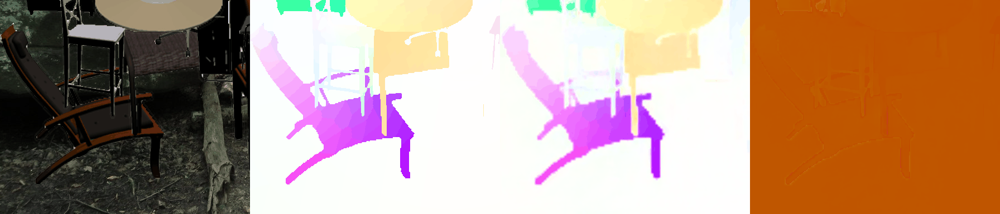
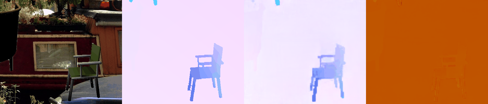
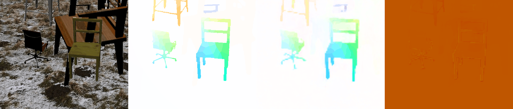
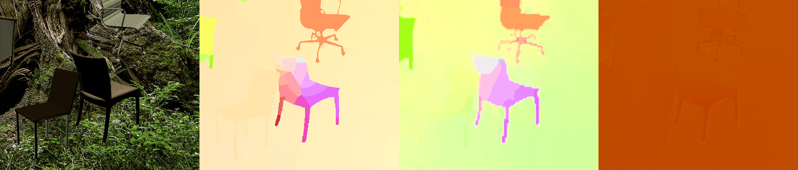
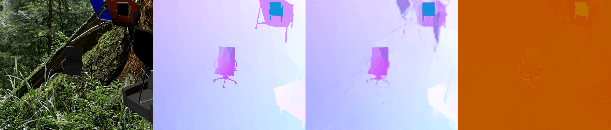
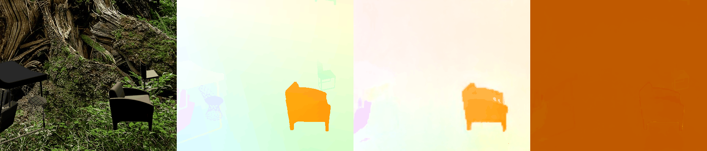
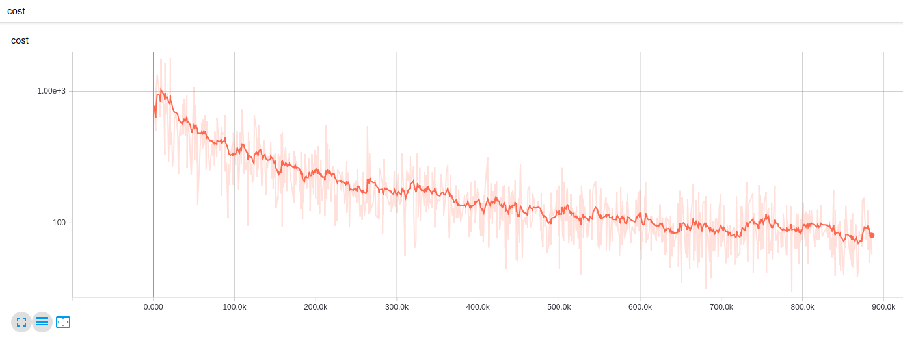

# PWC_Net_TensorFlow

Tensorflow implementation of Pyramid, Warping and Cost Volume Networks based on the [paper](https://arxiv.org/abs/1709.02371) presented at CVPR 2018.<br />
Currently, [main.py](https://github.com/djl11/PWC_Net_TensorFlow/blob/master/main.py) simply downloads the FlyingChairs Dataset and starts training, following the outlined [schedule](https://arxiv.org/abs/1709.02371).<br />
This code could easily be adapted to train on other datasets though.<br /><br />

## Tested Environment

Ubuntu 16.04<br />
Python3<br />
Tensorflow 1.8<br />
Cuda 9.0<br />

## Acknowledgements

This repo uses 3 custom written tensorfow ops in c++

The correlation op was taken from [this](https://github.com/simonmeister/UnFlow) tensorflow implementation of UnFlow by Simon Meister<br />
The ppm and flo decoding ops were taken from [this](https://github.com/lmb-freiburg/lmbspecialops) collection of tf ops, from the Computer Vision Group, Albert-Ludwigs-Universität Freiburg<br />

## Usage

```python
python3 main.py
```

A tensorboard session will automatically be started in a new tmux window (so that the visualisations are still available after the python session has ended).<br />
This tensorboard session will log the training/validation losses, as well as giffs of the flow as it trains.

Some general hyperparameters regarding the logging of data can be changed through [task.py](https://github.com/djl11/PWC_Net_TensorFlow/blob/master/task.py)<br />
Other hyperparameters relating to the training schedule can be changed in the constructor of [network.py](https://github.com/djl11/PWC_Net_TensorFlow/blob/master/network.py)<br />
The default training/validation split is to have 90% training, with 10% left for validation. <br />


## Example visualisations following training

From left to right, the images below indicate rgb image, ground truth flow, predicted flow, flow error<br />

Examples from the training set:<br />

<br />
<br />
<br />
<br />

Examples from the validation set:<br />

<br />
<br />
<br />
<br />

## Example Training Loss

This is an example of the loss when training on the full flying chairs dataset (no validation was used on this occassion).<br />

<br />
